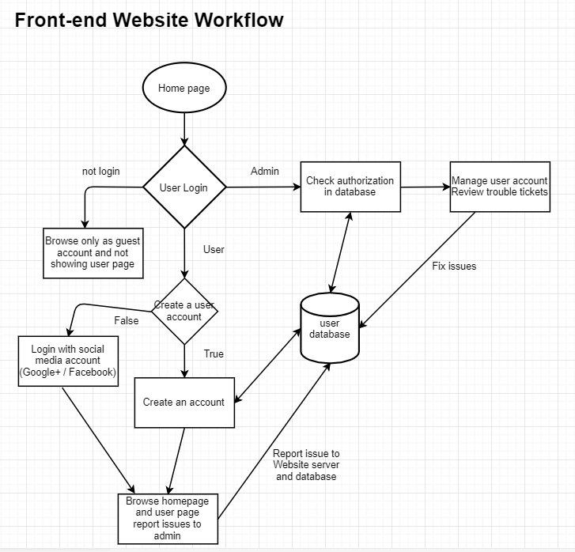

# Report

### Project Manager: Yi-Ting Lin
### Developer: Jimmy Tran
### Junior Developer: Divin Gregis Baniekona
### IT Operation: Henry Post
### UI/UX: Nihar Patel and Idris Fagbemi

#### 1. Language and framework of your choice:
Java and Kotlin as our languages for developing the web server logic in
Java Server Faces (JSF) for presenting our web application logic
Spring Boot as an ‘inversion of control’ framework to simplify configuration
Hibernate as an ORM engine to simplify CRUD operations. We use JDBC as the connection driver for Hibernate

#### 2. Operating System Platform of Choice:
The OS is Ubuntu server 16.04.
We use Apache Tomcat, Java 9, and MySQL Server.
Currently, there is no secret management.
However, all passwords and other information is easy-to-locate, standardized, and will be easy to change.
There is also no application metrics capture yet

#### 3. Use of Data Store/Storage:
Using MySQL to store user information, names, emails, etc.
We are planning on using iSCSI along with file paths to handle storing videos.
A table will be created to store information about the videos
(ID, Title, date of creation…) as well as a field that will contact the path to access the video.
We currently have the ORM engine working and can store a “Person” object without writing any SQL code.

#### 4. Data encrypted at rest:
Data is currently stored in plaintext in the MySQL database.
Data encryption at rest is planned. (Right now we don't have it)

#### 5. Database makes use of master/slave replication:
A single schema,there is currently no caching layer, and we use a single database.

#### 6. Use of Responsive design:
Using CSS to build multi platform of different scale monitor screens for clients.
We havne't build the style for smaller screen devices.

#### 7. Use of https:
We currently have no certificates or self-signing mechanism.
We are using JavaServer Faces (JSF) alongside a Server Filter and Session Managed Bean to authenticate users and ensure that only authenticated users may access certain pages.
We currently have no login authentication mechanism
We have port 8080 open for HTTP
We have no authentication keys currently
We do not seed the database currently

#### 8. Use of user authentication:
We do not currently use HTTPS.
There is a session in the form of cookies, but no logic to differentiate users as sessions yet. but is currently being configured by pairing UserID with SessionID.
Hibernate query is used to validate username and password from MySQL Database to allow user authentication.
The UI could easily be modified for authentication / un authentication users via CSS selectors.

#### 9. Creation of Dev Environment (local laptop):
The development environment is well-documented, but is not automatically creatable.
The instructions are in the form of a markdown file.
We currently don’t have any plan for UI/UX testing methodology and bug reporting.

#### 10. Layout design:
This is our website layout.
At top has all the navigations, which direct you to different pages.

#### 11. Management of Visio (or comparable) diagram tool of work flow:
This is the front-end website workflow.

This is the user experience flow.

This is the website server UML diagram.

#### 12. Management of project progress:
a. [Trello](https://trello.com/b/03OdRjtq/2019-team-07f)

b. [Slack](https://itmt-430-group.slack.com)

c. [GitHub](https://github.com/illinoistech-itm/2019-team-07f)

d. GitHub Issues to resolve bug posts from UI/UX tester

We will have it by final sprint.

#### 13. Team must generate at least 15 real “test” user data that is inserted upon instance creation and proper data to test functionality of a system:
We currently have no real test cases but will include in final sprint.
