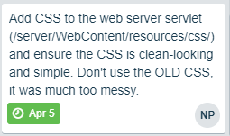
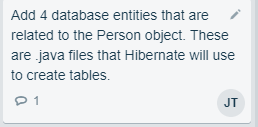
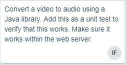

# Roles

Project Manager: Henry Post

Developer: Idris Fagbemi

Junior Developer: Yi-Ting Lin

IT Operation: Jimmy Tran

UI/UX: Nihar Patel, Divin Baniekona

# 1. Languages and frameworks


## a. Programming languages and frameworks

### Java and Kotlin
  
Java and Kotlin are used for web server logic, for modeling business objects,
and for data presentation.

Kotlin is used because of its ability to compile into `.class` files, making it
fully interoperable with Java `.class` files. It adds syntactic sugar,
shortcuts, and useful functional programming operators (`map`, `reduce`, `fold`) to
lots of objects.

### Java Server Faces 2.1

Java Server Faces (JSF) for presenting our web application logic. JSF was chosen
over Java Server Pages (JSP) because of its security benefits and ability to
create complex HTML elements easily.

### Apache Tomcat

Apache Tomcat is used because of its maturity and versatility. Version 9 is what
we use in dev, but we have deployed successfully on 8.5 and 8.0. 8.0 is used in
our virtual machines.

### Spring Boot

Spring Boot is used as an 'inversion of control' framework to simplify
configuration.

Spring boot allows us to take disparate configuration files that would otherwise
be scattered throughout the project amongst `.prop`, `.cfg`, and `.xml` files
and collect them into one file called `applicationContext.xml`.

### Hibernate

Hibernate is used as an ORM engine to simplify CRUD operations. Hibernate sits
in-between the database and our web application to essentially marshall
annotated Java Objects into a database table, and create/read/update/delete them
in a sql-dialect-agnostic way.

We use JDBC as the connection driver for Hibernate. This means we can use
MariaDB, PostgreSQL, or MySQL.

# 2. Operating System Platform of Choice:

## a. OS choice and reason

The OS is Ubuntu Server 16.04 for all VMs.

Filename:

    ubuntu-16.04.6-server-amd64.iso

Download:

http://releases.ubuntu.com/16.04/ubuntu-16.04.6-server-amd64.iso

Checksums:

    openssl_md5          = ac8a79a86a905ebdc3ef3f5dd16b7360
    openssl_sha1         = 056b7c15efc15bbbf40bf1a9ff1a3531fcbf70a2
    openssl_sha256       = 16afb1375372c57471ea5e29803a89a5a6bd1f6aabea2e5e34ac1ab7eb9786ac
    openssl_sha512       = ecbf736f54adf81d930583d5c99733e0f24eb78781755da37152b68fe55fa2bcdaf9933e1d7848fdb133ed910dc1e1e3dc17bb55ce0bfd251c68cf0837ce441a

We chose Ubuntu because of its maturity, ease of use, and heavy documentation.

Downsides are mainly a large ISO and resource-heavy VM because Ubuntu Server
comes with lots of packages pre-installed and pre-configured.


## b. Packages installed

Note: You can use the following commands to reproduce the below information:

    grep -rni "apt" packer/scripts/*
    grep -rni "apt" vagrant-config/*

### b1. General-purpose tools

    git \
    tmux \
    curl \
    gtop \
    lynx

For developer usage to ping, view, download, or monitor various points of
information.

Git is included in this list.

### b2. Automatic installation

    software-properties-common \
    debconf-utils

For auto-installation of packages that prompt users for input.

### b3. Languages/Frameworks

    default-jdk \
    maven \
    python3.6 \
    tomcat8 \
    mysql-client \
    mysql-server-5.7

#### i. .deb packages

No .deb packages are used.

## c. Language/Framework packages

We have one place where Java packages are required, and that's in
`/server/pom.xml`.

We use Java Server Faces, JSP API for Servlet Filters for authentication, ffmpeg
for media transcoding, Hibernate for ORM, and MySQL connectors, to name a few.

Here is a list of packages generated by "[Pom
Explorer](https://github.com/ltearno/pom-explorer)":

    black.ninia:jep:3.8.2
    ch.qos.logback:logback-classic:1.0.13
    com.example:jep-example:1.0-SNAPSHOT
    com.jolira:onejar-maven-plugin:1.4.4
    com.sun.el:el-ri:1.0
    commons-dbcp:commons-dbcp:1.4
    commons-io:commons-io:2.6
    edu.cmu.sphinx:sphinx4-core:5prealpha-SNAPSHOT
    edu.cmu.sphinx:sphinx4-data:5prealpha-SNAPSHOT
    javax.inject:javax.inject:1
    javax.servlet.jsp:javax.servlet.jsp-api:2.3.3
    javax.servlet:javax.servlet-api:4.0.1
    javax.xml.bind:jaxb-api:2.2
    mysql:mysql-connector-java:8.0.12
    net.bramp.ffmpeg:ffmpeg:0.6.2
    org.apache.maven.plugins:maven-compiler-plugin:3.5.1
    org.apache.maven.plugins:maven-jar-plugin:null
    org.apache.maven.plugins:maven-war-plugin:3.2.1
    org.apache.tomcat.maven:tomcat7-maven-plugin:2.2
    org.aspectj:aspectjrt:1.7.4
    org.codehaus.mojo:exec-maven-plugin:1.2.1
    org.glassfish:javax.faces:2.2.18
    org.hibernate:hibernate-core:5.2.12.Final
    org.hibernate:hibernate-entitymanager:5.2.12.Final
    org.jetbrains.kotlin:kotlin-maven-plugin:1.3.11
    org.jetbrains.kotlin:kotlin-stdlib:1.3.11
    org.slf4j:slf4j-api:1.7.5
    org.springframework.boot:spring-boot:2.1.3.RELEASE
    org.springframework:spring-core:5.0.2.RELEASE
    org.springframework:spring-orm:5.0.2.RELEASE
    org.springframework:spring-tx:5.0.2.RELEASE
    org.springframework:spring-webmvc:5.0.2.RELEASE
    searchable-video-library:searchable-video-library:0.0.1-SNAPSHOT
    xuggle:xuggle-xuggler:5.4

## d. Application metrics and monitoring

There is a `Jenkinsfile` at the root of the repo that will build, deploy, and
test this repository's code. It is fully functional on Windows Jenkins hosts.

Currently, application metrics remain in the form of errors and logs. That is to
say, there is no centralized place to monitor the performance and stability of
the application.

## e. Destroy script

With ruby installed, run `ruby destroy-everything.rb -f`.

Without the `-f` flag, it will prompt you to confirm in case it was run
accidentally.

# 3. Use of Data Store/Storage:

We are using MySQL 5.7 to store user information, names, emails, etc, and have
the MySQL server on a completely separate box.

We are planning on using iSCSI along with file paths to handle storing videos.
We have a separate VM whose only purpose is to act as an iSCSI target (server)
for the webserver to put large MP4/MP3 files.

A table will be created to store information about the videos (ID, Title, date
of creation...) as well as a field that will contact the path to access the
video.

We currently have the ORM engine working and can store a "Person" object without
writing any SQL code.

# 4. Data encryption at rest:

Data is currently stored in plaintext in the MySQL database.

User passwords are hashed.

Full data encryption at rest is planned.

Truecrypt for full disk encryption is also a good option to add to our security.

# 5. Database makes use of master/slave replication:

There is currently a single schema, there is no caching layer, and we use a
single MySQL database.

As the database is separated, it makes making master/slave boxes easier.

# 6. Use of Responsive design:

We do not need a framework to allow for responsive design.

Plain CSS with some discipline can achieve a clean, repeating, and responsive
interface.

We are using plain CSS to build responsive screens for clients. We are using
mobile-first designs and use relative units and relative positioning to allow
our interface to adapt to all screen sizes.


# 7. Use of HTTP over SSL:

## a. Self-signed certificates

We currently have no certificates or self-signing mechanism.

## b. Login authentication mechanism

### i. How it works

We are using Java Server Faces (JSF) alongside a Server Filter and a Session
Managed Bean to authenticate users and ensure that only authenticated users may
access certain pages.

Our login authentication mechanism is currently working and authenticates to our
database to provide access. This was done through Hibernate Query Language
(HQL).

### ii. How it's secured

The username is stored in a Java Servlet Session that the user can identify via
a cookie.

There is built-in CSRF protection in the form of a nonce that gets inserted with
all forms.

## c. Security assumptions

### i. Firewall

We have port 8080 open for HTTP, and only port 8080.

### ii. Authentication keys

Authentication keys are to be stored in `~/.ssh/id_rsa` on the host.

These are RSA private keys.

They are copied to the VM's disk, used to clone the git repository, and then
immediately deleted from the VM.

### iii. Seeding of usernames and passwords

We seed the database with 15 test users.

```sql
    INSERT INTO `person` (country, email, name, password, username)
    VALUES ('USA', 'hpost@hawk.iit.edu', 'Henry Post', 'forkbomb123', 'hpost'),
           ('USA', 'npatel117@hawk.iit.edu', 'Nihar Patel', 'pmsrock!!', 'npatel117'),
           ('USA', 'ifagbemi@hawk.iit.edu', 'Idris Fagbemi', 'dev4life', 'ifagbemi'),
           ('USA', 'dbaniekona@hawk.iit.edu', 'Divin Gregis Baniekona', 'itopsguy456', 'dbaniekona'),
           ('USA', 'ylin95@hawk.iit.edu', 'Yi Ting Lin', 'yitingrox', 'ylin95'),
           ('USA', 'jtron82@hawk.iit.edu', 'Jimmy Tran', 'uiuxuxui', 'jtron82'),

           ('Dominican Republic', 'carrjess21@gmail.com', 'Jessie Caraballo', 'carrain$!', 'jessiecar2'),
           ('Albania', 'vgoj@gmail.com', 'Victor Gojcaj', 'nycisforme', 'vgoj'),
           /*(...)*/
```

### iv. Pre-seeding databases with schema and records

Our only SQL script that gets executed, aside from inserting test data, is one
that creates a schema called `searchable-video-library`.

All tables are created from POJOs (Plain Old Java Objects) annotated with
Hibernate annotations and are created at runtime of the Apache servlet.
    
```java

    package com.teamteem.model;

    import javax.faces.bean.ManagedBean;
    import javax.persistence.*;
    import java.util.Set;
    
    @Entity
    @Table(name = "person")
    @ManagedBean(name = "person")
    public class Person {

        @Id
        @Column(name = "id")
        @GeneratedValue(strategy = GenerationType.IDENTITY)
        private int id;

        private String name;

        @Column(unique = true)
        private String username;

        @Column(unique = true)
        private String email;

        private String country;

        private String password;

        @OneToMany(mappedBy = "person")
        private Set<Video> videos;

        @OneToMany(mappedBy = "person")
        private Set<Audio> audios;

        @OneToMany(mappedBy = "person")
        private Set<Text> texts;
        
        //(...)
    
    }
```


# 8. Use of user authentication:

## a. Using webserver sessions

User sessions work by saving a username to a `jsessionid` that allows an
authenticated user to have a session after logging in with a valid username and
password.

## b. Different UI for unauthenticated users

Currently, the UI is the same for authenticated and unauthenticated users.

## c. Different UI for authenticated users

Currently, the UI is the same for authenticated and unauthenticated users.

## d. Different UI for administrative users

Currently, the UI is the same for administrative and unauthenticated users.

## e. UI is modified via CSS selectors

Currently, the UI is the same for authenticated and unauthenticated users.

# 9. Creation of Dev Environment (local laptop):

## a) Must work according to specification

Specific versions of required software are documented.

IDE setup is also documented.

The development environment is well-documented, but is not automatically
creatable.

However, you can run `ruby /packer/build-missing.rb` to build all missing packer
boxes, and `vagrant up` in `/` to bring the virtual machines up.

## b) Environment must be configurable via a script pre-deploy

All global configuration is stored in `/variables.yml`

## c) Explanation of UI/UX testing methodology

Currently, we only sporadically test and report bugs in UI/UX components.

## d) Github & Trello bug report proof

    TODO give proof via screenshots

# 10. Layout design:

This is our website layout.

The top has a navigation bar, which directs you to different pages.


## 11. Diagram tool management:

This is the front-end website workflow.


This is the user experience flow.


This is the webserver UML diagram.


# 12. Management of project progress

## a. Trello

[Trello link](https://trello.com/b/03OdRjtq/2019-team-07f)


## c. Development Environment

The development environment is documented in `/README.md` and
`/server/README.md`. It is cross-platform.

## d. GitHub goals and commits

### Adding CSS to web server



f7efe9f15441f7e3fb3472aca794355f95a4753d

15537020da74b20b307d31b1df78429117cc05b5

abe96ebf0e66e8793f94b7a19381e6cbb19615ce

### Adding Hibernate annotated POJOs



dfa326f171a685551c501cb3d840762d24f12729

bcfdb731e6e4e5f5957e0dfd935014c233cd215b

### Setting up an iSCSI target


b2cc43f4dc378b8356799a42a10207e6697d1587

5748ee1e9c7da8626bb40658cc22fe280486ed7f

### Converting Videos to MP3 files



8980360ac0bdb2cbef2dfae865072667996058b8

b3ce219c2117f53ceba5708afeb5e54986f87889

## e. GitHub Issues enumeration


### Open bugs

- [Existing RSA keys get clobbered by our RSA key name](https://github.com/illinoistech-itm/2019-team-07f/issues/19)
  
    - Assignee: No-one

- [Logging out produces error](https://github.com/illinoistech-itm/2019-team-07f/issues/18)

    - Assignee: Jimmy Tran

- [Storage box iSCSI server setup packer step fails](https://github.com/illinoistech-itm/2019-team-07f/issues/17)
      
    - Assignee: Divin Gregis Baniekona

- [Hardcoded mysql root user password](https://github.com/illinoistech-itm/2019-team-07f/issues/16)
          
    - Assignee: No-one
    
- [Build instructions missing port access](https://github.com/illinoistech-itm/2019-team-07f/issues/15)
              
    - Assignee: No-one

- [Vagrant box and version mismatch](https://github.com/illinoistech-itm/2019-team-07f/issues/14)
              
    - Assignee: No-one

- [User navigation is incorrect](https://github.com/illinoistech-itm/2019-team-07f/issues/13)
              
    - Assignee: No-one

### Closed bugs

- [Readme.md doesn't metion what to do without ruby installed](https://github.com/illinoistech-itm/2019-team-07f/issues/21)

    - Assignee: No-one

- [Vagrant .box file included in repo](https://github.com/illinoistech-itm/2019-team-07f/issues/14)

    - Assignee: No-one

# Trello Board:


# 13. Insertion of test users upon application deployment

We currently have 15 test users that get inserted into the database when the
application is built.
